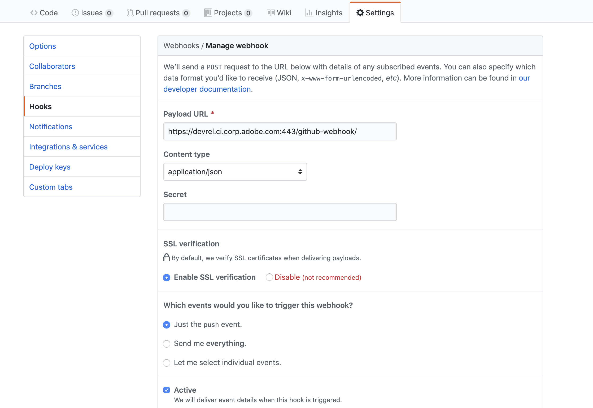
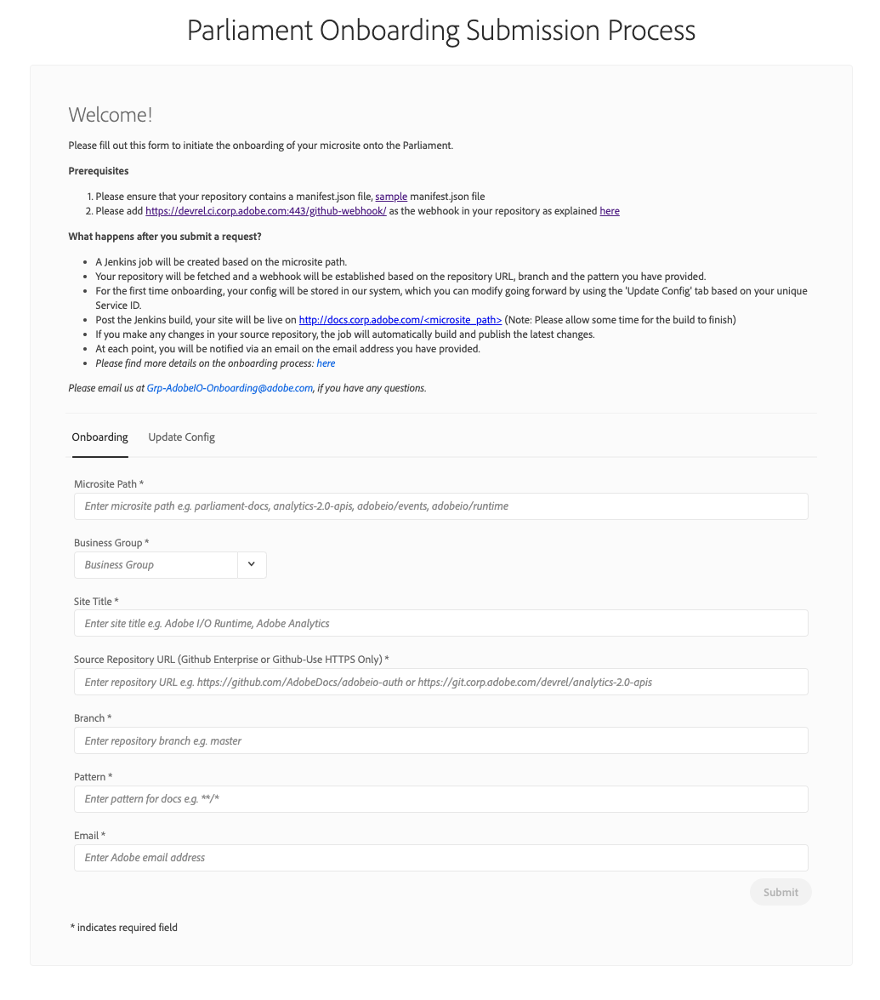

# Onboarding Process


## Prerequisites

### 1. Manifest file for site navigation

A sidebar is an identity of your website, it provides a nice, consistent and logical navigation to your website. Parliament expects a manifest file in json format to populate the navigation sidebar.

Please find a sample manifest.json file here: [manifest.json](https://github.com/AdobeDocs/adobeio-auth/blob/stage/manifest.json)

```json
{
  "name": "Parliament Onboarding",
  "version": "1.0.0",
  "description": "Onboarding docs for Parliament",
  "author": "DevRel Team",
  "view_type": "mdbook",
  "meta_keywords": "adobe, parliament",
  "meta_description": "default description",
  "publish_date": "30/08/2018",
  "show_edit_github_banner": false,
  "base_path": "https://raw.githubusercontent.com",
  "pages": [
    {
      "importedFileName": "readme",
      "pages": [
        {
          "importedFileName": "onboarding",
          "pages": [],
          "path": "DevRel/parliament-docs/master/onboarding.md",
          "title": "Onboarding"
        }
      ],
      "path": "DevRel/parliament-docs/master/README.md",
      "title": "Overview"
    }
  ]
}
```

### 2. Github / Github Enterprise webhook

Parliament can build the site dynamically, upon a push event to the target branch. i.e. When you push a change to your Github / Github Enterprise repository, the website will automatically gets updated. Cool, isn't it? In order to achieve this, please follow below steps:

#### i. In your repository go to Settings -> Hooks

#### ii. Add below webhook

| Webhook                                              |                                                      |
| ---------------------------------------------------- | ---------------------------------------------------- |
| Payload URL                                          | https://devrel.ci.corp.adobe.com:443/github-webhook/ |
| Content type                                         | application/json                                     |
| SSL Verification                                     | Enable                                               |
| Which events would you like to trigger this webhook? | Just the push event.                                 |
| Active                                               | True                                                 |



## Onboarding

### Parliament Onboarding Form

Once the prerequisite is complete, you are all set to onboard your documentation on Parliament.

Please follow below steps:

#### 1. Open the Parliament Onboarding form

[https://git.corp.adobe.com/pages/devrel/parliament-onboarding/](https://git.corp.adobe.com/pages/devrel/parliament-onboarding/)

#### 2. Fill out the form with below details:

| Form                  |                                                                                                                                  |
| --------------------- | -------------------------------------------------------------------------------------------------------------------------------- |
| Microsite Path        | Specify a subpath for your website i.e. http://docs.corp.adobe.com/<microsite_path>                                              |
| Business group        | Specify a business group i.e. Creative cloud, Document cloud, Experience cloud, Cloud platform, Sensei, Image                    |
| Source Repository URL | Specify URL to your Github/Github enterprise repository i.e. https://git.corp.adobe.com/devrel/my-doc-site                       |
| Site title            | Specify a title for your website i.e. My Site                                                                                    |
| Branch                | Specify a branch from which the content should be fetched i.e. master                                                            |
| Pattern               | Specify a pattern in which the content should be fetched. i.e. `**/*` to fetch everything, `docs/**` to include everything under docs folder, `**/*,!**/test/**` to exclude a particular `test` folder from the build or `*.json, docs/**` to include all json files from root level and everything under docs folder. Please learn more [here](https://github.com/mrmlnc/fast-glob#basic-syntax)|
| Email address         | Specify an email address to receive updates and notifications.                                                                   |

#### 3. Click on `Submit`



## What happens after you submit a request?

i. A Jenkins job will be created based on the Service Name.

ii. Your repository will be fetched and a webhook will be established based on the repository URL, branch and the pattern you have provided.

iii. For the first time onboarding, your config will be stored in our system, which you can modify going forward by using the 'Update Config' tab based on your unique Service ID.

iv. Post the Jenkins build your site will be live on http://docs.corp.adobe.com/<your_microsite_path> (Note: Please allow some time for the build to finish)

v. If you push any changes to your target branch in your source repository the job will automatically build and publish the latest changes.

vi. At each point you will be notified via an email on the email address you provided.
